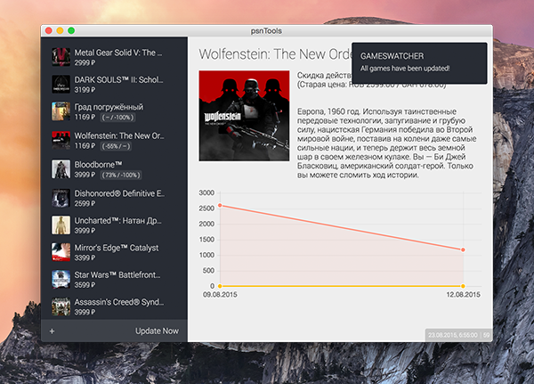

# psnTools

Desktop application for tracking prices in PSN.

Using: [Chart.js](http://www.chartjs.org/) (simple HTML5 Charts using the canvas element)



### Build

By default, this build osx64 app only.

```bash
$ npm run build
```

### License

Copyright (C) 2015 Sancho

This program is free software: you can redistribute it and/or modify
it under the terms of the GNU General Public License as published by
the Free Software Foundation, either version 3 of the License, or
(at your option) any later version.

This program is distributed in the hope that it will be useful,
but WITHOUT ANY WARRANTY; without even the implied warranty of
MERCHANTABILITY or FITNESS FOR A PARTICULAR PURPOSE.  See the
GNU General Public License for more details.

You should have received a copy of the GNU General Public License
along with this program.  If not, see http://www.gnu.org/licenses/.
